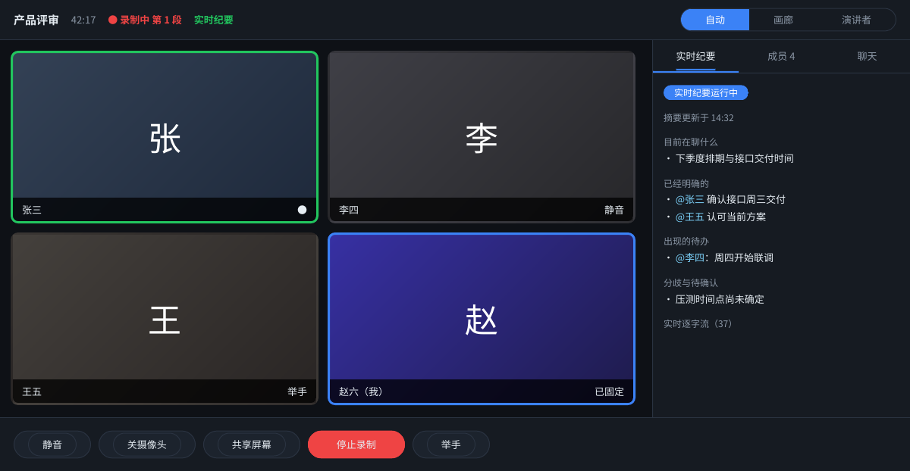

<h1 align="center">InsideMeeting</h1>

<p align="center">
  自建的内部视频会议系统。不限时长，不限人数套餐，录制文件存在自己的机器上。<br/>
  自动生成会议纪要，并且用 <code>@某某</code> 标注每条结论出自谁。
</p>

<p align="center">
  = 20" />
  
  
  
  
</p>

<p align="center">
  
</p>

## 它解决什么问题

主流会议软件的免费版有 40 分钟限制，付费版按人头收费，录像存在别人的云上。这套东西是为了绕开这三件事而写的：

|  | 主流会议软件 | InsideMeeting |
|---|---|---|
| 时长 | 免费版 40 分钟 | 不限 |
| 人数 | 按套餐 | 2–8 人（mesh 架构上限） |
| 录制 | 存云端，常要付费 | 存自己机器，分轨保存 |
| 会议纪要 | 附加功能，常要单独付费 | 内置。会中实时 + 会后完整 |
| 发言人区分 | 声纹聚类，会认错 | 按音轨分离，100% 准确 |
| 部署 | 无 | 需要一台常开的机器 |

## 核心能力

- **视频会议**：2–8 人，纯 P2P，画面不经过服务器
- **屏幕共享**：有人开始共享时，所有人画面自动切过去
- **三种布局**：画廊 / 演讲者（自动跟随当前发言人）/ 自动；双击可固定某人
- **会中实时纪要**：约 20 秒延迟的滚动逐字流，每分钟刷新一版结构化摘要。中途加入的人一进来就能看到前面聊了什么
- **分轨录制**：每人麦克风单独一条音轨，不限时长，每 60 分钟自动切一个可独立播放的文件
- **会后完整纪要**：逐字稿 + 会议纪要 + 待办表格 + 发言时长统计，全部用 `@某某` 标注归属
- **纪要自动推送**：生成完自动发到企业微信 / 飞书 / 邮件，配了哪个发哪个
- **会议密码与等候室**：房间级密码、主持人审批入会、锁定会议、移出成员
- **虚拟背景与增强降噪**：MediaPipe 人像分割做背景模糊/换图，噪声门压掉底噪
- 会中聊天、举手、请他人静音、浏览器本地字幕
- 电脑和手机都能用（手机不支持发起屏幕共享，系统限制）
- [桌面 App](desktop/README.md) 内嵌完整服务端：双击安装就能当服务器，不用装 Node 和 ffmpeg

## 30 秒了解设计取舍

这套系统有三个不那么常规的决定，理解它们就理解了整个架构：

**1. 媒体走 P2P，服务器只做信令和存储。** 8 人以内 mesh 完全够用，服务器不解码任何一路视频，一台 Mac mini 就能扛。代价是超过 8 人要改 SFU。

**2. 录制在客户端做，每人只录自己的麦克风。** 这样发言人归属是 100% 准确的——谁的音轨就是谁说的，不需要声纹聚类。代价是每个人必须用自己的设备入会。

**3. 会中和会后是两条独立的转写链路。** 会中每 15 秒一个独立小片，延迟优先；会后用完整音轨重转一遍，质量优先。会中识别歪的地方，会后那份仍然是准的。

## 快速开始

### 最省事：装桌面 App

去 [Releases](https://github.com/SSSSKRXX/InsideMeeting/releases) 下载对应系统的安装包，双击安装。首次启动选「**这台电脑当服务器**」，服务就跑起来了。

**不需要装 Node.js、不需要装 ffmpeg、不需要下载源码、不需要改配置文件**——都在 App 里。界面会直接显示入会地址，复制发给同事即可。

> 还是要装 [Tailscale](https://tailscale.com/download) 并让所有人登录同一个账号，否则跨网络连不通。这是网络层的事，App 代劳不了。全员在同一个局域网可以跳过。

### 或者：从源码跑

```bash
git clone https://github.com/SSSSKRXX/InsideMeeting.git
cd InsideMeeting

bash scripts/start.sh     # Windows: powershell -ExecutionPolicy Bypass -File scripts\start.ps1
```

`start.sh` 会依次检查依赖、生成证书、安装依赖、构建前端、启动服务。前置条件只有两个：Node.js ≥ 20 和 ffmpeg。

**API 密钥不用改配置文件**——起来之后打开 `#/admin` 进管理后台，在「设置」页填就行，保存立即生效。

想先看看界面长什么样，可以直接双击项目根目录的 `demo.html`——不需要启动任何服务。

## 文档

| 文件 | 内容 |
|---|---|
| 本文档 | 部署、配置、架构说明 |
| [`InsideMeeting 使用说明.pdf`](InsideMeeting%20使用说明.pdf) | 发给团队成员的使用手册，假设读者完全不懂技术 |
| [`desktop/README.md`](desktop/README.md) | 桌面 App：内嵌服务端的原理、怎么打包 |
| [`tray/`](tray/) | 早期的菜单栏程序，已被桌面 App 取代，保留给从源码部署的人 |
| [`deploy/windows-autostart.md`](deploy/windows-autostart.md) | Windows 开机自启 |
| [`deploy/turnserver.conf`](deploy/turnserver.conf) | 走公网时的 coturn 配置 |
| `demo.html` | 静态界面预览，双击即可打开 |

---

## 一、架构

```
              ┌─────────────── Mac mini ────────────────┐
              │  信令（Socket.IO）· 静态页面             │
  张三 ◄──────┤  录制落盘 · 实时转写调度 · 纪要生成      ├──────► 李四
    │         └──────────────────────────────────────────┘         │
    │                                                              │
    └──────── 音视频 P2P 直连（走 Tailscale，不经服务器）──────────┘
```

**媒体走 P2P，服务器只做信令和存储。** 8 人以内 mesh 完全够用，Mac mini 不解码任何一路视频，CPU 几乎不动。

**录制在客户端做。** 每个人的浏览器只录自己的麦克风，实时分片上传。这样发言人归属 100% 准确——谁的音轨就是谁说的，不需要声纹聚类，不会把两个人认成一个。

**会中和会后是两条独立的转写链路：**

| | 会中实时纪要 | 会后完整纪要 |
|---|---|---|
| 音频来源 | 每 15 秒一个独立小片，即传即转 | 完整连续音轨 |
| 优先级 | 延迟优先（约 20 秒） | 质量优先 |
| 静音处理 | 服务端过滤，静音片不送 ASR | 静音检测后只转有声区间 |
| 结果 | 滚动摘要，每分钟重写 | 逐字稿 + 结构化纪要 + 待办 |

两条链路互不干扰。会中识别歪了的地方，会后那份仍然是准的。

**为什么不共用一条链路**：连续录制产生的中间分片没有容器头部，单独拿出来解不了码。多起一个 MediaRecorder 的代价只是一次额外的 opus 编码，远小于它省下的复杂度。

---

## 二、部署（一台常开的机器 + Tailscale）

大家都在各自家里，所以用 Tailscale 把所有设备组成一个虚拟内网。这样不需要公网 IP、不需要端口映射、不需要 TURN，也不对公网暴露任何端口。

**服务器不必是 Mac mini。** 任何一台满足下面三条的机器都行：

- 装了 Node.js ≥ 20 和 ffmpeg（macOS / Windows / Linux 都支持）
- 能一直开着不休眠——会议进行中主机睡了会直接断会
- 在同一个 Tailscale 网络里

旧笔记本、办公室的台式机、NAS 上的 Docker、云服务器都可以。选 Mac mini 只是因为它功耗低、适合 7×24 常开。下文以 Mac mini 举例，Windows 的做法见后面单独一节。

服务器的配置要求很低：媒体流走 P2P 不经过它，它只做信令、落盘和调度转写，8 人会议时 CPU 几乎不动。唯一吃资源的是会后转写——但那是调云端 API，本机只做音频切片。

### 1. 组网

在 Mac mini 和每个人的电脑/手机上装 Tailscale，登录同一个账号（或用 Tailnet 邀请成员）：

```bash
brew install --cask tailscale   # Mac mini
```

手机端在 App Store / 应用商店搜 Tailscale 即可。装完登录，就在同一个虚拟内网里了。

在 Tailscale 管理后台的 DNS 页面**打开 MagicDNS 和 HTTPS Certificates**——这一步能让你拿到真证书，浏览器不会有任何安全警告。

### 2. 装依赖并启动

```bash
brew install node ffmpeg

cd ~/InsideMeeting
cp .env.example .env      # 填 API Key，见下方配置
bash scripts/gen-cert.sh  # 检测到 Tailscale 会自动申请正式证书
npm install
npm run build
npm start
```

或直接 `bash scripts/start.sh`，上面几步一次做完。

启动后把地址发给同事，形如 `https://macmini.你的tailnet.ts.net:8443`。

> **为什么必须 HTTPS**：浏览器只在 https 或 localhost 下才允许网页访问摄像头、麦克风和屏幕共享。`tailscale cert` 给的是 Let's Encrypt 正式证书，所以没有任何警告。证书 90 天过期，脚本会提示你加一条 crontab 自动续期。
>
> 如果没能拿到 Tailscale 证书，脚本会回退到自签证书，首次访问点「高级 → 继续前往」也能用，只是每台设备都要点一次。

### 3. 开机自启 + 不休眠

```bash
# 改好里面的路径
cp deploy/com.inside.meeting.plist ~/Library/LaunchAgents/
launchctl load ~/Library/LaunchAgents/com.inside.meeting.plist

# 防止 Mac mini 睡过去导致会议中断
sudo pmset -a sleep 0 disksleep 0
```

### 服务端跑在 Windows 上

Node 代码本身是跨平台的（路径全用 `path.join`，没有任何 Mac 专属调用），**换成 Windows 主机也能跑**，只是启动脚本和开机自启的做法不同：

```powershell
winget install OpenJS.NodeJS.LTS
winget install Gyan.FFmpeg          # 装完要重开终端，让 PATH 生效
winget install tailscale.tailscale

cd C:\InsideMeeting
copy .env.example .env              # 填 API Key
powershell -ExecutionPolicy Bypass -File scripts\start.ps1
```

`start.ps1` / `gen-cert.ps1` 是 `.sh` 那两个脚本的 PowerShell 版本，功能完全一致（同样会优先申请 Tailscale 正式证书；没装 openssl 时会自动改用 Windows 内置的证书接口生成自签证书）。

开机自启用任务计划程序或 NSSM，步骤见 [`deploy/windows-autostart.md`](deploy/windows-autostart.md)。

两个 Windows 专属的坑：

- **防火墙**：首次启动会弹「是否允许 node.exe 通信」，**必须勾选「专用网络」**，否则别人连不进来。注册成服务时不会弹窗，得手动加放行规则（文档里有命令）。
- **ffmpeg 不在 PATH**：装完 ffmpeg 一定要重开终端。实在不行就在 `.env` 里把 `FFMPEG_PATH` 和 `FFPROBE_PATH` 写成 exe 的完整路径。

Linux 同理可跑，把 `brew` 换成 `apt` 即可（实际上本项目的自动化测试就是在 Linux 上跑的）。

### 换成别的组网方式

`.env` 里的 `NETWORK_MODE` 控制 ICE 策略：

- `tailscale`（默认）/ `lan` —— peer 之间可直连，不使用 STUN/TURN
- `public` —— 走公网，需要配 `STUN_URLS`，跨 NAT 还要自建 TURN（`deploy/turnserver.conf` 已备好 coturn 配置）

**参会者装不了 Tailscale 怎么办**（iOS 中国区 App Store 已下架它）：参会者本来就不需要装任何软件，网页在浏览器里跑就行。Tailscale 在这套系统里只提供两件事 —— 「服务器可达」和「P2P 直连」，分别用 Cloudflare Tunnel 和 TURN 替代即可，`NETWORK_MODE` 改成 `public`。

注意媒体流是 P2P 的，**不走隧道**，所以 TURN 那一步不能省。Cloudflare Realtime TURN 不接受静态用户名密码，填 `CF_TURN_KEY_ID` / `CF_TURN_API_TOKEN` 即可，服务端会拿它定时换取临时凭证。走 TURN 中转时流量按 GB 计费，建议手机参会的人关掉摄像头 —— 会议纪要只依赖音轨，视频关掉完全不影响。

---

## 三、怎么用

### 开会

浏览器打开服务地址，填姓名和房间号。**姓名很重要**——它就是纪要里 `@某某` 的那个名字。房间号相同的人自动进同一个会。

### 视图

右上角切换布局：

- **自动**（默认）—— 有人共享屏幕就切到共享画面，否则画廊视图
- **画廊** —— 所有人平铺，不管有没有人在共享
- **演讲者** —— 大画面跟随当前说话人，其他人在底部条

**双击任意一个人的画面可以固定他**，再双击取消。固定后不再自动跟随。

正在说话的人边框会亮起（本地音量检测，不消耗任何额度）。

### 实时纪要

默认自动开启。右侧「实时纪要」面板会看到：

- 上半部分：每分钟刷新一次的结构化摘要（在聊什么 / 已明确的 / 待办 / 分歧）
- 下半部分：展开可看约 20 秒延迟的滚动逐字流

中途加入的人一进来就能拿到前面的全部内容，不用问"刚才说到哪了"。

想省额度可以随时点面板里的按钮关掉；也可以点「立即刷新」强制重写一版摘要。

### 录制

工具栏点「⏺ 开始录制」，全房间所有人**同时**开始录各自的麦克风轨。这是有意的——少录一个人，纪要里就少一个发言人。

录制中顶部显示「● 录制中 第 N 段」，每满 60 分钟自动切下一段，无缝继续。

### 会后纪要

进「会议记录」页面，选中这场会，点「生成逐字稿与会议纪要」。一场 1 小时 4 人的会大约几分钟。

产出：

- **逐字稿** `transcript.md` — `[00:12:33] @张三：……`，按全局时间轴排序
- **会议纪要** `summary.md` — 关键结论、分议题纪要、待办表格、悬而未决事项
- **待办** `actions.json` — 结构化的事项/负责人/截止时间
- **发言统计** — 每人说了多久、多少轮

名字填错了，在「录制文件」页点「改名」修正，再点「仅重写纪要」——不重新转写，不重复花钱。

### 命令行批处理

```bash
node server/src/cli-process.js --list     # 列出所有会议
node server/src/cli-process.js --all      # 处理所有还没出纪要的会议
node server/src/cli-process.js <会议ID>
```

配合 crontab 夜间统一处理：

```
0 2 * * * cd ~/InsideMeeting && /opt/homebrew/bin/node server/src/cli-process.js --all
```

---

## 四、手机端

手机浏览器直接打开同一个地址即可。装了 Tailscale 的手机在外面也能连。

| 功能 | iPhone (Safari) | Android (Chrome) |
|---|---|---|
| 视频会议、看共享 | ✅ | ✅ |
| 布局切换、聊天、举手 | ✅ | ✅ |
| 看实时纪要 | ✅ | ✅ |
| 录制自己的音轨 | ✅（录成 mp4，服务端已兼容） | ✅ |
| **发起**屏幕共享 | ❌ 系统不支持 | ❌ 系统不支持 |
| 浏览器本地字幕 | ❌ | ✅ |

手机上不支持的按钮会自动隐藏。工具栏在手机上只显示图标，纪要和聊天收进底部抽屉。

一个实际提醒：**手机上要把浏览器保持在前台**。切到后台或锁屏后，iOS 会暂停 MediaRecorder，这段音频就录不到了。手机参会的人如果需要发言被记进纪要，建议别锁屏。

---

## 五、配置

全部在 `.env`，完整清单见 `.env.example`。最少要改的：

```bash
ASR_BASE_URL=https://api.openai.com/v1
ASR_API_KEY=sk-xxx
ASR_MODEL=whisper-1

LLM_BASE_URL=https://api.openai.com/v1
LLM_API_KEY=sk-xxx
LLM_MODEL=gpt-4o-mini
```

纪要模型是 OpenAI 兼容接口，可以换成任何兼容服务商（DeepSeek、Moonshot、通义、硅基流动），或指向本机 Ollama 做到全程离线。

转写支持两种**形态完全不同**的接口，在设置里选「转写接口类型」：

| | OpenAI 兼容 | 小米 MiMo |
|---|---|---|
| 路径 | `/audio/transcriptions` | `/chat/completions` |
| 认证 | `Authorization: Bearer` | `api-key` 头 |
| 传音频 | multipart 文件上传 | base64 塞进 messages |
| 时间戳 | 有 | 无 |

**填错类型会直接 404**——这是最容易踩的坑，因为地址和密钥看起来都对。默认的「自动判断」会按地址和模型名识别，一般不用手动选。

小米 MiMo 的配置：地址 `https://api.xiaomimimo.com/v1`，模型 `mimo-v2.5-asr`。

> MiMo 不返回时间戳，所以用它时系统会把音频切得更碎（每片最长 45 秒而不是 240 秒），让时间轴精度不至于太粗。这会让请求数变多，但单价通常能抵消。

**关于成本**。三道闸门在控制实时纪要的开销：

1. 客户端丢掉体积过小的片（基本是纯静音）
2. 服务端对每个片做静音检测，没有人声就直接删掉，不送 ASR
3. 距上次摘要新增字数不足 `LIVE_MIN_CHARS`（默认 60 字）就跳过这轮摘要

实测：一个 15 秒的纯静音片产生 0 次 ASR 调用；六个有声片只触发了 1 次摘要。分轨录音里每个人大部分时间是不说话的，这几步通常能砍掉大部分开销。

常用配置：

| 变量 | 说明 |
|---|---|
| `NETWORK_MODE` | `tailscale` / `lan` / `public` |
| `LIVE_ENABLED` | 实时纪要总开关，默认 true |
| `LIVE_CHUNK_SECONDS` | 实时小片长度，默认 15 秒。调小延迟更低但请求更多 |
| `LIVE_SUMMARY_SECONDS` | 摘要刷新间隔，默认 60 秒 |
| `LIVE_MIN_CHARS` | 新增字数不到这个值就跳过摘要，默认 60 |
| `SEGMENT_MINUTES` | 录制切分间隔，默认 60 |
| `CHUNK_SECONDS` | 录制分片上传间隔，默认 5 秒 |
| `JOIN_PASSWORD` | 入会口令，留空不校验 |
| `ASR_LANGUAGE` | `zh` / `en` / `auto` |
| `ASR_CONCURRENCY` | 会后转写并发数，默认 3 |

---

## 六、录制和纪要存在哪、谁能看

**只有一份，全在服务器上。**

每个人的浏览器只是录自己的麦克风然后立刻上传（每 5 秒一个分片），**本地不留副本**，浏览器关掉就没了。主持人那边也不会额外存一份。所有录制文件、逐字稿、纪要都汇总在服务器的数据目录下。

好处是不会散落在各人电脑里，删除和归档都只需要管一个地方。代价是**任何能访问服务的人都能看到全部历史记录**——所以「设置 → 安全 → 查看会议记录的口令」这一项要设上。不设的话，能打开会议地址的人就能翻到公司所有会议的录音和全文。

三道口令各管一件事，互相独立：

| 口令 | 管什么 | 不设的后果 |
|---|---|---|
| 全局入会口令 | 能不能进会议 | 知道地址就能进任何房间 |
| 查看会议记录的口令 | 能不能看历史录音和纪要 | 能进会的人也能翻全部历史 |
| 管理口令 | 能不能进管理后台 | 任何人都能改配置、删录制 |

房间密码是第四道，由主持人在会中单独给某个房间设，和上面三个是叠加关系。

## 七、文件存在哪

```
data/recordings/<会议ID>/
├── manifest.json               参会人、分段、时间戳、聊天记录、实时摘要快照
├── <peerId>__mic__s000.webm    张三的麦克风，第 1 段（0-60 分钟）
├── <peerId>__mic__s001.webm    张三的麦克风，第 2 段（60-120 分钟）
├── <peerId>__mic__s000.webm    李四的麦克风，第 1 段
├── <peerId>__screen__s000.webm 屏幕共享画面
├── transcript.md / .json       逐字稿
├── summary.md                  会议纪要
└── actions.json                待办
```

实时纪要用的临时小片在 `data/tmp/live/` 下，用完即删（`LIVE_KEEP_AUDIO=true` 可保留排查问题）。

webm 文件用 VLC、Chrome、剪映、Final Cut 都能直接打开。转 mp4：

```bash
ffmpeg -i 输入.webm -c:v h264_videotoolbox -c:a aac 输出.mp4
```

---

## 八、已知限制

- **浏览器**：电脑端建议 Chrome 或 Edge。Safari 能开会，MediaRecorder 支持有限。
- **人数**：mesh 架构下每人要给其他所有人各发一路视频，8 人时上行约需 10 Mbps。要开 15 人以上的会得引入 SFU（mediasoup / LiveKit），服务端改动不小，但客户端和录制/纪要这套逻辑可以完全复用。
- **说话人区分**：靠音轨分离，前提是每个人用自己的设备入会。**两个人共用一台电脑一个麦克风，会被记成同一个发言人。**
- **实时纪要的准确率**低于会后那份。15 秒的小片缺少上下文，专有名词和人名更容易识别错。会后的完整链路有整段上下文，明显更准。
- **手机切后台**会暂停录制，这段音频会缺失。
- **静音时段**不会被转写，符合预期。
- **断网**：录制分片上传失败会自动重试（指数退避），分片留在内存队列里不丢；但重试期间关掉标签页，那部分会丢失。
- **房间配置不跨会议保留**：所有人退出 2 分钟后，房间密码、等候室、锁定状态、主持人令牌都会清空。这是有意的，否则 `data/rooms.json` 会无限膨胀。录制文件不受影响。
- **Windows 上强杀 App**（任务管理器结束进程、崩溃）会留下一个占着端口的服务端进程。新版本启动时会自动清理；如果端口是被别的程序占着，会弹窗给出 PID 和清理命令。

## 九、主持人与会议安全

第一个进入房间的人自动成为主持人，可以在会中「设置」标签页里控制：

| 能力 | 说明 |
|---|---|
| 房间密码 | 设在房间上，存的是 scrypt 哈希。**所有人退出 2 分钟后自动清空** |
| 等候室 | 新人进来先在门外等，主持人点允许才进得来。超过 5 分钟没人理会自动放弃 |
| 锁定会议 | 谁都进不来，适合会议已经开始不想被打断 |
| 移出成员 | 把人踢出会议 |

> **会议结束后房间会被清空。** 所有人都退出、并且过了 2 分钟宽限期之后，这个房间的
> 密码、等候室、锁定状态和主持人令牌会一并作废。下一次有人用同一个房间号进来就是
> 全新的一场会，第一个进去的人成为主持人。宽限期是为了兜住「刷新页面」「网络抖了一下」，
> 这段时间内有人回来，会议就继续。
>
> **录制文件不受影响。** 录音、逐字稿、纪要都在 `data/recordings/<会议ID>/` 下，
> 被清掉的只是 `data/rooms.json` 里的一条配置记录。要清磁盘请走管理后台的「存储与清理」。
>
> 想让房间密码长期保留：把 `server/src/roomstore.js` 顶部的 `WIPE_ON_START` 改成 `false`，
> 并去掉 `signaling.js` 里 `scheduleEnd` 中的 `dropRoom` 调用。

主持人身份靠令牌维持，存在浏览器 localStorage 里。刷新页面、断线重连都还是主持人。

主持人掉线时，主持权会临时交给最早进来的人，避免会议失控。**原主持人重连回来仍然是主持人**——令牌是多个并存的，不会互相覆盖。这在「网络抖了一下」的场景下很重要。

> 全局口令（`.env` 里的 `JOIN_PASSWORD`）和房间密码是两道独立的门。前者是所有房间通用的，后者由主持人按房间设置。

## 十、纪要自动推送

会后纪要生成完会自动推送。三个渠道各自独立，`.env` 里配了哪个就发哪个，没配的静默跳过，某个渠道失败也不影响其它渠道。

```bash
# 企业微信：群设置 → 群机器人 → 添加 → 复制 Webhook
WECOM_WEBHOOK=https://qyapi.weixin.qq.com/cgi-bin/webhook/send?key=xxx

# 飞书：群设置 → 群机器人 → 添加自定义机器人。开了签名校验就填 FEISHU_SECRET
FEISHU_WEBHOOK=https://open.feishu.cn/open-apis/bot/v2/hook/xxx

# 邮件：需要先装依赖 npm --workspace server install nodemailer
SMTP_HOST=smtp.qq.com
SMTP_USER=you@qq.com
SMTP_PASS=授权码
MAIL_TO=a@company.com,b@company.com
```

想让消息里的「查看完整纪要」按钮可点，还要配 `PUBLIC_BASE_URL`。

自动推送失败时，可以在会议记录页点「推送纪要」手动补发。

## 十一、虚拟背景与降噪

都在会中「设置」标签页。

**增强降噪**在浏览器自带的回声消除之上，额外做了两件事：85Hz 高通砍掉空调和风扇的低频隆隆声，噪声门压掉说话间隙的底噪。后者对会议纪要的价值比对听感更大——安静时段的底噪会让语音识别产生幻听文本（凭空冒出"谢谢观看"之类），压掉之后服务端的静音检测能更干净地整段跳过。

**虚拟背景**用 MediaPipe 人像分割，支持背景模糊和换成自选图片。模型默认从 CDN 加载，国内网络可能不通，建议先在服务器上跑一次：

```bash
bash scripts/fetch-models.sh    # 把模型和 wasm 下到 web/public/models/
npm run build
```

下载失败也不影响使用，前端会自动回退到在线加载，只是第一次开启会慢一些。

两个功能都做了同一件事：**处理链输出的音视频轨是固定的**。开关只改内部参数，不换 track，所以不需要重新协商 WebRTC，也不会打断正在进行的录制。

## 十二、管理服务

有两个入口，各管一摊。

### 菜单栏程序（管服务本身）

装在跑服务的那台机器上，右上角一个图标，不用再开终端：

```bash
bash 打包桌面程序.command    # 选 2，打出 dmg
```

能做的事：启动/停止/重启服务、看当前有几个房间几个人、一键复制入会地址（优先用 Tailscale 的 100.x 地址）、开机自启、看日志、打开数据目录。

服务本身还是那个独立的 node 进程——菜单栏程序只是控制它。所以终端跑、launchd 跑、菜单栏程序跑，三种方式随时可以换，不会互相锁死。

> 需要机器上装了 Node.js。打包时刻意没把 Node 塞进去，就是为了保留上面这个灵活性。

### 网页管理后台（管数据和配置）

访问 `#/admin`，或从入会页右下角进。需要 `.env` 里的 `ADMIN_TOKEN`（没设就留空直接进）。

| 标签页 | 能做什么 |
|---|---|
| 服务状态 | 运行时长、内存、负载、进行中的会议和参会人；没配完时有醒目提示 |
| **设置** | **API 密钥、口令、推送渠道、录制参数全都在这里改，保存立即生效** |
| 房间管理 | 改房间密码、开关等候室、锁定/解锁、吊销主持人令牌 |
| 存储与清理 | 改录制/纪要的保存位置、每场会议占多少空间、按天数清理旧录制 |
| 日志 | 服务日志尾部 |

### 不用碰 .env 了

原来配 API Key 得 ssh 上服务器改 `.env` 再重启——这道门槛足以让整套系统用不起来。现在 25 项常用配置都搬到了「设置」页：

- **AI 服务**：转写和纪要模型的地址、密钥、模型名、会议语言
- **安全**：全局入会口令、管理口令、查看会议记录的口令
- **实时纪要**：开关、刷新间隔、触发阈值
- **录制**：切分间隔、上传分片间隔
- **纪要推送**：企业微信、飞书、SMTP 全套

`.env` 仍然是默认值的来源，界面上改的值会覆盖它，存在 `data/settings.json`，**保存后立即生效，不用重启**。每一项旁边都标了对应的环境变量名，以后想改回用 `.env` 管理也认得出来。

三个细节：

**密钥永远只显示掩码**（`sk-t••••7890`），明文不会回传到浏览器。留空表示「不改」而不是「清空」——否则改个别的字段一保存，所有密钥就都没了。真要清空有单独的按钮。

**每个 AI 服务和推送渠道旁边都有「测试」按钮**，真发一次请求。配错 key 这种事不测是发现不了的，等到会后生成纪要才报错就太晚了。

**没配完时会有醒目提示**，直接引导到设置页。

**房间管理是兜底入口**——主持人自己在会中就能改这些，这里是为了应对主持人离职了、或者密码没人记得了的情况。「吊销主持人令牌」之后，下一个进房间的人会成为新主持人。

**清理默认只删音视频文件，保留纪要和逐字稿。** 后者是纯文本几乎不占空间，删了却再也拿不回来。而且清理按钮默认先跑预演，告诉你会删什么、释放多少，确认后才真删。

### 改保存位置

录制文件会持续变大（一场 2 小时 6 人的会几百 MB），纪要只有几十 KB。所以这两个可以分开设：**录制放外置盘或 NAS，纪要留在系统盘跟着备份**。

两个入口：

- **网页后台 → 磁盘与清理**：服务端会把常用位置和外接磁盘列成可点的候选，也可以手敲绝对路径，保存前会先测试能不能写。
- **菜单栏程序 → 录制/纪要保存位置**：直接弹系统的文件夹选择框。它跑在服务器那台机器上，所以能这么做；浏览器不行。

改的时候可以勾「同时搬移已有文件」。同一个磁盘内是瞬间完成的，跨磁盘会退化成复制再删，几十 GB 会比较慢。不搬的话新会议存到新位置，旧的留在原地——**界面上就看不到那些历史会议了**。

改动立即生效，不用重启。配置存在 `data/storage.json`，`.env` 里的 `DATA_DIR` 仍然是默认值的来源。

## 十三、后续可以加的东西

1. **多轨合成成片**：ffmpeg 把各人音轨和屏幕共享合成一个带画廊视图的 mp4，发给没参会的人
2. **实时纪要问答**：会中直接问"刚才关于排期说了什么"，基于已有逐字流回答
3. **会议室预约与日程集成**：和飞书/企微日历打通
4. **SFU 模式**：突破 8 人上限，客户端和录制/纪要逻辑可以完全复用

---

## 十四、验证状态

已在开发环境实测通过：

**基础链路**

- 前端构建通过，服务端启动正常，各 API 正常响应
- 分片上传：文件切 3 片依次上传后，服务端拼接结果与原文件**字节完全一致**
- 60 分钟切分：模拟 3 小时会议产生 3 个独立 webm，每个都能被 ffprobe 单独读出完整时长
- 静音检测：15 秒测试音频（有声 0-3s / 6-10s / 13-15s）准确识别出 3 个区间
- 跨音轨时间对齐：两人音轨起始相差 5 秒，合并后逐字稿的时间戳与发言人归属均正确
- 信令：两客户端加入、offer 中转、录制指令全房间同步、聊天、离会广播全部通过
- 会后纪要：mock ASR/LLM 跑通完整流水线，产出逐字稿 + 纪要 + 发言统计
- 异常处理：转写全部失败时报明确错误，而不是产出一份空逐字稿

**实时纪要**

- 有声小片正确转写并按绝对时间推送给房间内所有人（时间戳偏移计算正确）
- **纯静音片被过滤，产生 0 次 ASR 调用**
- 新增字数未达阈值时自动跳过摘要；点「立即刷新」可强制生成
- 摘要通过 socket 实时推送到所有人的会中视图
- 中途加入者拿到完整的历史逐字流和最新摘要

**组网**

- `NETWORK_MODE=tailscale` 时 `/api/config` 返回空 `iceServers`，客户端走 host candidate 直连

**主持人与等候室**

- 第一个进房间的人自动成为主持人并拿到令牌
- 密码错误被拒、密码正确放行、锁定会议后新人被拒
- 等候室：新人进入等候队列，主持人收到实时列表，点允许后成功入会
- **放行后的成员信令通路正常**（这里有个坑：被放行的人是在主持人的连接上下文里被处理的，如果不把会话状态回写到他自己的连接，他之后发的所有消息都会被丢掉）
- 非主持人执行主持人操作被拒绝
- 主持人掉线后主持权自动移交，**原主持人凭旧令牌重连仍是主持人**
- 主持人踢人

**纪要推送**

- 企业微信和飞书收到格式正确的消息，含标题、时间、参会人、纪要正文和跳转链接
- 会后流水线跑完自动触发推送，推送结果写回 manifest
- 单个渠道失败不影响其它渠道，也不会让整个流程算失败

---

## 十五、安全提醒

- **`.env` 已被 gitignore**，里面有 API Key，不要强制提交。
- **`data/` 目录已被 gitignore**，里面是会议录音和纪要原文，不要提交到任何代码仓库。
- **`certs/` 已被 gitignore**，含 TLS 私钥。
- **仓库公开时务必设置 `JOIN_PASSWORD`**。代码公开后房间号是可以猜的，而房间密码要主持人进会后才能设——也就是说第一个进去的人就成了主持人。全局口令是唯一能挡在这之前的一道门。顺便把 `ADMIN_TOKEN` 也设上，它管的是删除录制这类操作。

## 十六、许可

[MIT](LICENSE)
